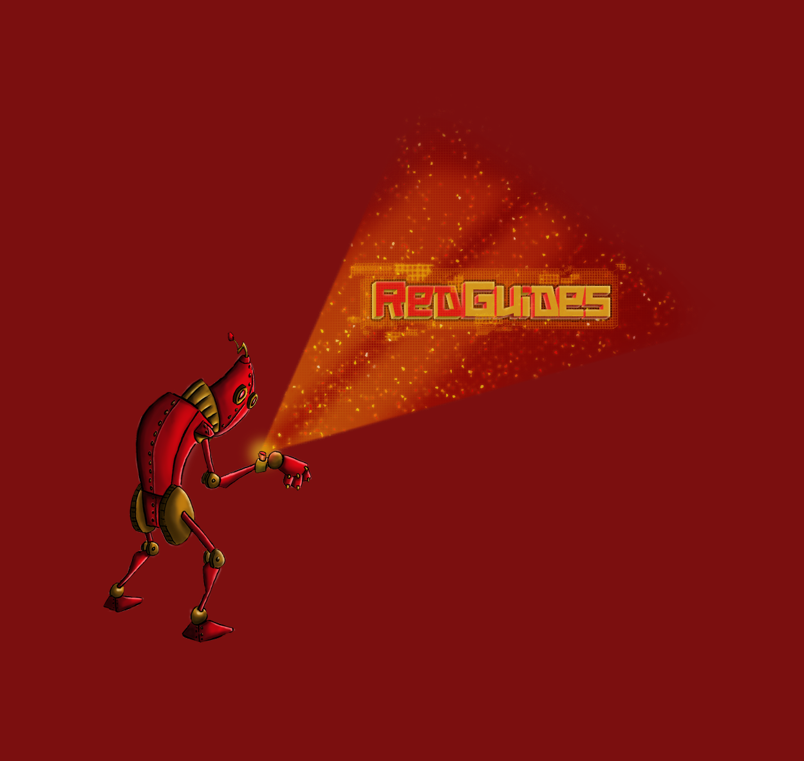
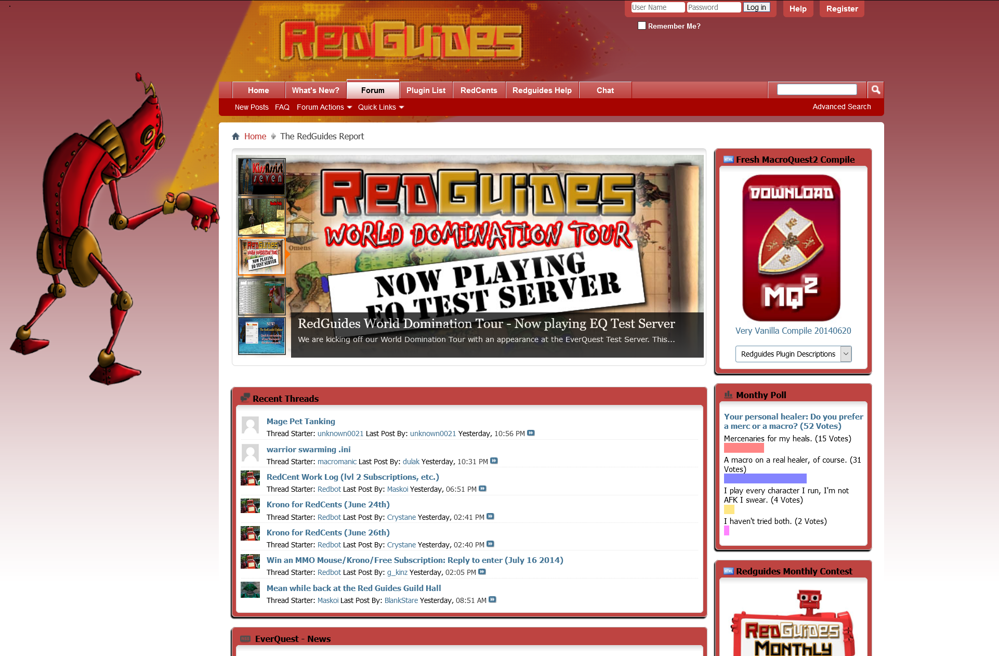

# A Catalog and Reference of EverQuest Software

<!-- Example of rotating images in the original wiki; listed here as Markdown images:
  
  
  
  
  
 -->

These docs catalog player-made software for EverQuest, with a focus on multiboxing. Most everything is based on the open-source MacroQuest platform.

Our featured page is the [Command Index](Command_Index.md): a single, customizable page of in-game commands.

If we're missing something important, please consider [Adding a manual](Adding_a_manual.md), and if you're feeling generous with your time, look at [Wanted](Wanted.md).

---

## Documentation

• [Command Index](Command_Index.md), a quick reference for in-game commands.  

Help expand this wiki! See our [Wanted](Wanted.md) page.

---

## Set Up and Run Very Vanilla MQ

• [Getting started with RedGuides and Very Vanilla MQ (video series)](https://www.redguides.com/community/resources/multiboxing-everquest-the-red-guide-videos.1603/)  
• Add functionality by [installing scripts](https://www.redguides.com/community/resources/multiboxing-everquest-the-red-guide-videos.1603/) (video)  
• Can't afford RedGuides level 2? You can join for free by sharing your [tips, thoughts, or laughs](https://www.redguides.com/community/help/redcents/) with the community.  
• Feeling ambitious? Build your own copy of MacroQuest with our "[Open Vanilla](https://gitlab.com/redguides/openvanilla)" repository.  

---

## Develop and Extend

• Search through [Top-Level Objects](#) (TLOs) and [Data Types](#).  
• Visit us on [gitlab/redguides](https://gitlab.com/redguides), and read how to [contribute](https://www.redguides.com/community/threads/git-very-vanilla-forking-x-workflow.70582/). To access all repos, make sure you [link your gitlab account](https://www.redguides.com/amember/login).  
• Read the [Resource Rules and Guidelines](https://www.redguides.com/community/help/resourcerules/) before posting your work.  
• [Add a manual](Adding_a_manual.md) for a script/plugin/project.  

---

## Support

• To get help, [search first](https://www.redguides.com/community/search/).  
• Have a general question? Get help in the [Questions forum](https://www.redguides.com/community/forums/requests-and-questions.19/).  
• We have a [chatroom](https://www.redguides.com/community/rg-discord/) for support as well, though searching first is still recommended.  
• If you have a membership issue, [contact us here](https://www.redguides.com/community/misc/contact).  

---

## Site Navigation

• [Forums](https://www.redguides.com/community/)  
  • [New posts](https://www.redguides.com/community/whats-new/)  
  • [General](https://www.redguides.com/community/forums/hail-a-fire-beetle.20/)  
  • [Questions](https://www.redguides.com/community/forums/requests-and-questions.19/)  
  • [Strategies](https://www.redguides.com/community/forums/strategies.17/)  
  • [Emulator forum](https://www.redguides.com/community/forums/eqemu-underground.95/)  
• [Resources](https://www.redguides.com/community/resources/)  
  • [Apps](https://www.redguides.com/community/resources/categories/apps-software.2/)  
  • [Macros](https://www.redguides.com/community/resources/categories/macros.8/)  
  • [Plugins](https://www.redguides.com/community/resources/categories/plugins.11/)  
  • [Lua scripts](https://www.redguides.com/community/resources/categories/lua.25/)  
• [Chat](https://www.redguides.com/community/rg-discord/)  
• [Membership](https://www.redguides.com/amember/)  
  • [Manage](https://www.redguides.com/amember/member)  
  • [Subscribe](https://www.redguides.com/everquest-multiboxing/)  
  • [Forgot password](https://www.redguides.com/amember/login?sendpass)  